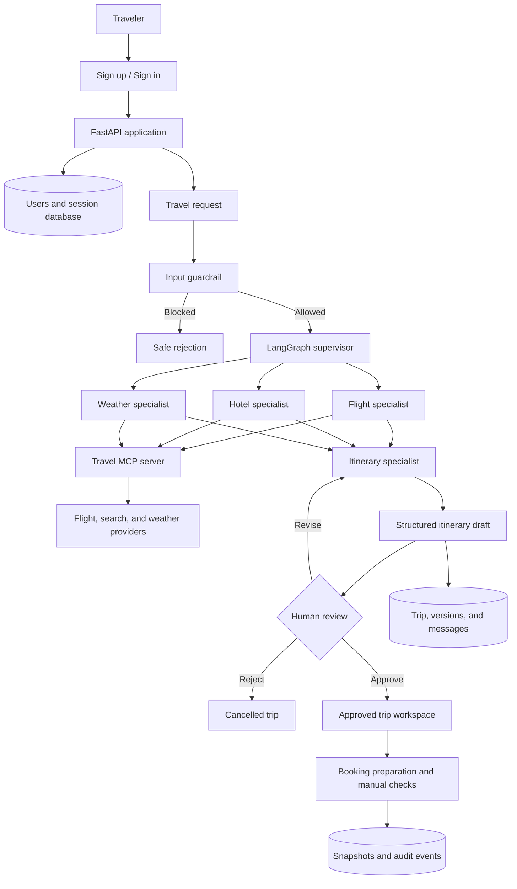

# TripMate project workflow and implementation audit

## What the project is

TripMate is a FastAPI web application that coordinates a supervised travel-planning workflow. A user creates an account, asks for a trip, specialist agents collect travel information, an itinerary agent creates a readable and structured plan, and the workflow pauses until the user approves, revises, or rejects it.

## Runtime workflow



The browser sends JSON to `app.py`. HTTP routes use services for authentication and workspace actions, repositories for owner-scoped trip persistence, SQLAlchemy models for application data, and `backend.py` for the LangGraph agent workflow. External travel calls cross the local stdio MCP boundary in `travel_mcp_server.py`.

## Main packages

| Area | Responsibility | Current state |
| --- | --- | --- |
| `app.py` | FastAPI routes, cookies, HTML/static delivery | Implemented |
| `backend.py` | Guardrail, supervisor, specialists, approval interrupt | Implemented |
| `services/auth_service.py` | Password hashing and revocable sessions | Implemented |
| `repositories/trip_repository.py` | Owner-scoped trips, versions, and messages | Implemented |
| `services/workspace_service.py` | Booking preparation and manual monitoring actions | Partial/demo |
| `database/` | Models, connection lifecycle, Alembic migrations | Implemented |
| `domain/` | Validated structured trip-plan types | Implemented |
| `tools/` and MCP servers | Flight, hotel/search, weather integration | Implemented with provider fallbacks |
| `static/` and `templates/` | Responsive browser interface | Implemented |
| `guardian/` | Automatic risk detection and recovery | Scaffold only |
| `chat/` | Trip-scoped follow-up conversation and intent routing | Scaffold only |
| `providers/` | Dedicated booking/payment adapters | Scaffold only |

## Implementation status

The planning MVP is usable end to end: accounts, saved trips, multi-agent research, structured itinerary generation, human approval, revisions, plan versions, and manual workspace checks are present. The larger product vision is not finished: booking buttons currently prepare candidates but do not purchase, payments are database models only, monitoring is manual, and Guardian recovery plus trip-scoped chat have not been built.

A useful progress reading is:

- Core planning MVP: **about 85%** — complete enough for a supervised demo.
- Full product roadmap: **about 55%** — major post-planning capabilities remain.

| Capability | Estimated completion | Evidence |
| --- | ---: | --- |
| Authentication and sessions | 90% | Registration, login, logout, hashing, cookies, and ownership checks work |
| Agent planning workflow | 90% | Guardrail, supervisor, three research agents, itinerary generation, and review loop work |
| Trip persistence and versions | 85% | Trips, immutable versions, messages, ownership, and restore behavior work |
| Browser interface | 85% | Responsive auth, planning, saved trips, approval, workspace, and PDF UI work |
| Provider integrations | 65% | Flight, web search, and weather tools exist with fallbacks; reliability depends on API setup |
| Booking and payments | 25% | Candidate preparation and database models exist; real checkout does not |
| Monitoring and Guardian | 20% | Manual checks and snapshots exist; scheduled risk/recovery workflow does not |
| Trip chat | 10% | Package boundary exists, but conversation and intent routing are not built |

These percentages are engineering estimates based on the checked-in scope, not measured delivery metrics.

## Authentication behavior

Registration accepts a display name, valid email, and password of at least 10 characters. Passwords are stored as salted PBKDF2 hashes. Sign-in creates a random session token; only its SHA-256 hash is stored. The raw token is sent in a 30-day, HttpOnly, SameSite=Lax cookie and is revoked on logout.

At startup, TripMate creates any missing SQLAlchemy tables so a fresh local checkout can register immediately. Alembic remains the source of truth for managed deployments and schema upgrades.

## Local startup

```text
python -m pip install -r requirements.txt
alembic upgrade head
python -m uvicorn app:app --reload
```

Open `http://127.0.0.1:8000`. If `APP_DATABASE_URL` and `DATABASE_URL` are both absent, application data uses `tripmate.db`. PostgreSQL is recommended for durable shared deployment and LangGraph checkpoints.

## Remaining roadmap

1. Add real booking-provider adapters with explicit confirmation and idempotency.
2. Implement payment creation, verification, failure recovery, and webhook handling.
3. Build scheduled Guardian monitoring, risk fingerprinting, alerts, and recovery proposals.
4. Add trip-scoped chat that can answer questions and propose versioned changes.
5. Add browser end-to-end tests and production deployment checks for HTTPS cookies, migrations, secrets, logging, and rate limiting.
